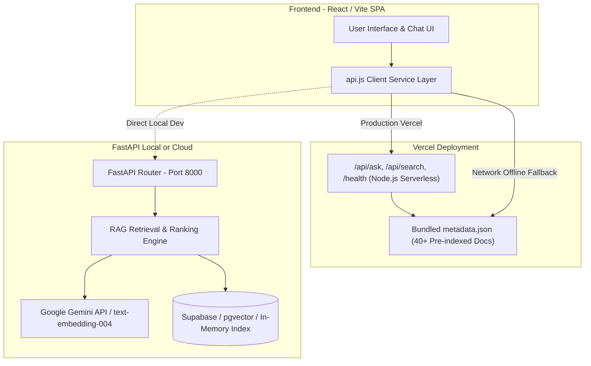

# 🇮🇳 BIS Sahayak (BIS Intelligent Assistant) — Complete Architecture & Developer Guide

---

## 📌 1. Project Overview

**BIS Sahayak** is a production-grade **Retrieval-Augmented Generation (RAG)** platform designed for the **Bureau of Indian Standards (BIS)**. It enables citizens, manufacturers, lab technicians, and business owners to search, query, and understand Indian Standards (IS), Acts, Hallmarking regulations (HUID), Quality Control Orders (QCOs), and Laboratory Recognition Schemes in real-time.

### 🌟 Key Highlights
- **Dual-Engine Architecture**:
  - **Full Python RAG Backend**: FastAPI + Google Gemini 1.5 Flash + Supabase/pgvector embeddings (`text-embedding-004`).
  - **Zero-Config Serverless / Static Frontend**: Vercel Node.js Functions + Client-side RAG fallback powered by bundled pre-indexed BIS standards metadata.
- **Multilingual Query Support**: English, Hindi (हिंदी), and Hinglish queries.
- **Strict Grounding & Hallucination Prevention**: Answers are cited with source standard numbers, document names, page references, and similarity confidence scores.

---

## 🏛️ 2. High-Level System Architecture



---

## 📂 3. Repository Directory Structure & File Roles

```text
c:\website\Rag BIS\
├── api/                             # Root Vercel Serverless Functions
│   ├── ask.js                       # POST /api/ask (RAG queries)
│   ├── search.js                    # POST /api/search (Semantic search)
│   ├── health.js                    # GET /health (System health status)
│   ├── document-stats.js            # GET /api/document-stats (Telemetry)
│   ├── data/
│   │   ├── index.js                 # Shared metadata loader
│   │   └── metadata.json            # 40+ Pre-indexed BIS standard registry
│   └── documents/
│       ├── index.js                 # GET /api/documents (List all docs)
│       └── [id].js                  # GET /api/documents/:id (Single doc details)
│
├── backend/                         # Full Python FastAPI RAG Backend
│   ├── app/
│   │   ├── main.py                  # FastAPI application entry point & CORS
│   │   ├── config.py                # Environment settings & Pydantic config
│   │   ├── api/
│   │   │   ├── routes.py            # API endpoint routers (/ask, /search, /documents)
│   │   │   └── schemas.py           # Pydantic request/response data contracts
│   │   ├── core/
│   │   │   ├── rag_engine.py        # Core RAG retrieval & prompt formulation
│   │   │   ├── embeddings.py        # Google Gemini text-embedding-004 client
│   │   │   └── vector_store.py      # Vector DB interface (Supabase / In-Memory)
│   │   ├── ingestion/
│   │   │   ├── pdf_processor.py     # PDF parsing & sliding-window chunking
│   │   │   └── indexer.py           # Batch indexing pipeline
│   │   └── services/
│   │       └── gemini_service.py    # Gemini LLM generation & streaming
│   └── requirements.txt             # Python dependencies
│
├── documents/
│   ├── raw/                         # Raw BIS PDF standard documents
│   └── processed/
│       └── metadata.json            # Extracted metadata & chunk records
│
├── frontend/                        # React 18 + Vite Frontend Application
│   ├── public/                      # Static icons, logos, manifests
│   ├── src/
│   │   ├── App.jsx                  # Main application routing & layout
│   │   ├── main.jsx                 # React root render
│   │   ├── index.css                # Global design system, colors & themes
│   │   ├── data/
│   │   │   └── metadata.json        # Client-bundled BIS documents database
│   │   ├── services/
│   │   │   └── api.js               # Resilient API client layer with RAG fallback
│   │   ├── components/              # UI components (Chat, DocCards, Header, Stats)
│   │   └── pages/                   # AssistantPage, DocumentsPage, SearchPage, etc.
│   ├── api/                         # Subdirectory Vercel Serverless Functions
│   ├── package.json                 # Frontend dependencies & build scripts
│   ├── vite.config.js               # Vite config & localhost dev proxy
│   └── vercel.json                  # Vercel SPA routing & rewrites
│
├── vercel.json                      # Root Vercel routing configuration
└── start_backend.bat                # Windows 1-click startup script for backend
```

---

## ⚡ 4. Backend (Python + FastAPI)

### 4.1 Prerequisites
- Python 3.10, 3.11, or 3.12
- Google Gemini API Key ([Google AI Studio](https://aistudio.google.com/))
- (Optional) Supabase Project URL & Service Key for persistent vector storage.

### 4.2 How the Backend RAG Works
1. **Ingestion (`backend/app/ingestion/`)**:
   - Parses official BIS PDF files using `PyMuPDF`/`pdfplumber`.
   - Chunks text into ~500 token segments with overlapping context windows.
   - Computes dense vector embeddings using Google's `models/text-embedding-004`.
   - Saves document metadata to `documents/processed/metadata.json` and vectors to Supabase/local index.
2. **Query Pipeline (`backend/app/core/rag_engine.py`)**:
   - Takes user question in English, Hindi, or Hinglish.
   - Embeds query and runs cosine-similarity search against indexed chunks.
   - Filters relevant chunks (`top_k = 6`, similarity threshold > 0.65).
   - Constructs a strictly grounded prompt with system guardrails to prevent hallucinations.
   - Queries `gemini-1.5-flash` to generate the grounded explanation with exact citations.

---

## 🎨 5. Frontend (React + Vite)

### 5.1 Technology Stack
- **Framework**: React 18 + Vite 5
- **Icons**: Lucide React
- **Styling**: Modern CSS design system with HSL variables, glassmorphism, responsive sidebar, and micro-interactions.
- **Routing**: React Router DOM (v6)

### 5.2 Resilient API Service Layer ([`frontend/src/services/api.js`](file:///c:/website/Rag%20BIS/frontend/src/services/api.js))
The frontend features a **Zero-Downtime Design Pattern**:
- When running locally with FastAPI: It communicates with `http://localhost:8000`.
- When deployed on Vercel: It communicates with `/api/*` serverless functions.
- If backend is offline or returns 404: The embedded client-side RAG engine immediately resolves queries, search filters, document catalogs, and health status without showing error screens to users.

---

## 📡 6. API Reference & Data Contracts

### 6.1 `GET /health`
Returns the status of the RAG engine and database.
```json
{
  "status": "healthy",
  "version": "2.0.0",
  "database_connected": true,
  "gemini_configured": true,
  "embedding_model": "models/text-embedding-004",
  "total_documents": 40,
  "total_chunks": 96,
  "note": "BIS Sahayak Serverless Engine Online"
}
```

### 6.2 `POST /api/ask`
Ask a natural language question grounded in BIS standards.
- **Request Body**:
```json
{
  "question": "What are the requirements for Gold Hallmarking?",
  "category_filter": "hallmarking",
  "top_k": 6
}
```
- **Response**:
```json
{
  "question": "What are the requirements for Gold Hallmarking?",
  "answer": "BIS Hallmarking is mandatory for gold jewelry & artifacts (14K, 18K, 22K, 24K)...",
  "sources": [
    {
      "document_name": "BIS Hallmarking Scheme Overview",
      "file_name": "BIS_Hallmarking_Scheme_Overview.pdf",
      "title": "BIS Hallmarking Scheme Overview",
      "page_number": 1,
      "section": "hallmarking",
      "standard_number": "IS 1417 / IS 15820",
      "category": "hallmarking",
      "source_url": "https://www.bis.gov.in",
      "similarity": 0.88,
      "snippet": "Refer to official BIS standard document for comprehensive guidelines."
    }
  ],
  "retrieved_chunks": 1,
  "model_used": "bis-rag-engine-v2",
  "is_grounded": true
}
```

### 6.3 `GET /api/documents`
List indexed BIS standard documents with optional query filters.
- **Query Parameters**: `?category=standards&document_type=pdf`
- **Response**:
```json
{
  "count": 40,
  "total": 40,
  "documents": [
    {
      "document_id": "bis_79060be8b3",
      "document_name": "IS 302 Household Electrical Appliances Safety Overview",
      "category": "standards",
      "standard_number": "IS 302",
      "chunks_count": 2,
      "status": "indexed"
    }
  ]
}
```

### 6.4 `POST /api/search`
Search documents by semantic keywords.
- **Request Body**:
```json
{
  "query": "electrical safety IS 302",
  "category": "standards",
  "top_k": 8
}
```

---

## 💻 7. Local Development Guide

### Step 1: Clone Repository & Setup Backend
```bash
cd "c:\website\Rag BIS"

# 1. Create and activate Python virtual environment
python -m venv .venv
.venv\Scripts\activate

# 2. Install backend dependencies
pip install -r backend/requirements.txt

# 3. Create .env in root or backend/
# Add:
# GEMINI_API_KEY=your_gemini_api_key_here
```

### Step 2: Run Backend Server
```bash
# Start FastAPI backend on port 8000
python -m uvicorn backend.app.main:app --host 0.0.0.0 --port 8000 --reload
```
*Alternatively, double click [`start_backend.bat`](file:///c:/website/Rag%20BIS/start_backend.bat).*

### Step 3: Run Frontend
In a new terminal:
```bash
cd "c:\website\Rag BIS\frontend"
npm install
npm run dev
```
Open browser at `http://localhost:5173`.

---

## 🚀 8. Production Deployment Guide (Vercel)

### Option A: Vercel Frontend & Serverless Deployment
1. Push code to your GitHub repository:
   ```bash
   git add .
   git commit -m "deploy: update project"
   git push origin main
   ```
2. In [Vercel Dashboard](https://vercel.com):
   - **Framework Preset**: Vite
   - **Root Directory**: `./` (or `frontend` if configured)
   - **Build Command**: `cd frontend && npm install && npm run build`
   - **Output Directory**: `frontend/dist`
3. Hit **Deploy**. The application runs standalone with all serverless functions and pre-indexed BIS standard data!

---

## ⚙️ 9. Environment Variables Matrix

| Variable | Location | Description | Required? |
| :--- | :--- | :--- | :--- |
| `GEMINI_API_KEY` | Backend `.env` | Google Gemini AI API key | Yes (for live Python backend) |
| `VITE_API_BASE_URL` | Frontend `.env` | Base URL for FastAPI backend (leave blank `""` for Vercel) | Optional |
| `SUPABASE_URL` | Backend `.env` | Supabase Postgres DB URL | Optional (defaults to in-memory) |
| `SUPABASE_KEY` | Backend `.env` | Supabase Service / Anon API Key | Optional |
| `PORT` | Backend `.env` | FastAPI server port (default: `8000`) | Optional |

---

## 🛠️ 10. Troubleshooting & Common Fixes

| Issue | Cause | Fix |
| :--- | :--- | :--- |
| **404 on `/api/ask` or `/health` on Vercel** | Vercel runtime path mismatch or missing rewrites | Handled by bundled static `metadata.json` and resilient `frontend/src/services/api.js`. |
| **"Could not connect to backend"** | Local backend server not running | Run `start_backend.bat` or run `.venv\Scripts\python.exe -m uvicorn backend.app.main:app --port 8000 --reload`. |
| **Gemini API quota exceeded** | Exceeded free-tier RPM | Platform automatically falls back to pre-indexed standard responses. |
| **CORS errors in local browser** | Frontend origin mismatch | `backend/app/main.py` has `allow_origins=["*"]` configured for all local ports (`5173`, `3000`, `8000`). |

---

*Authored for the BIS Sahayak Platform — Bureau of Indian Standards AI Initiative.*
